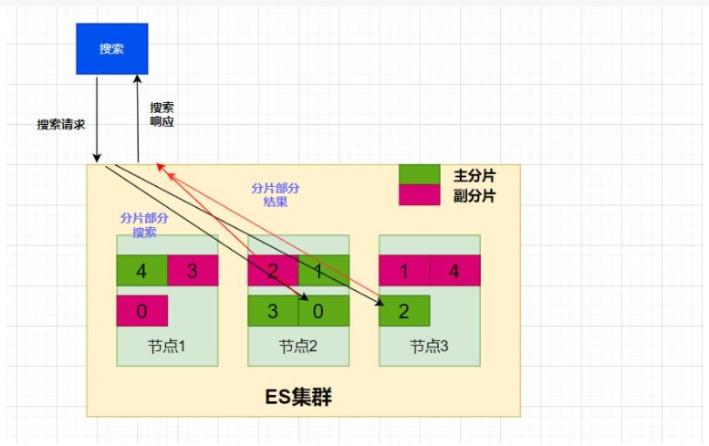
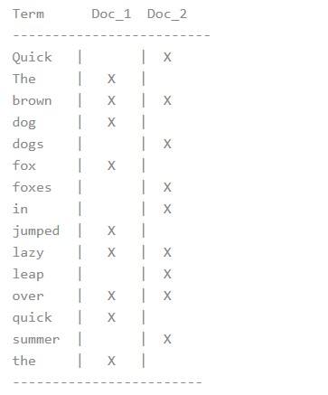
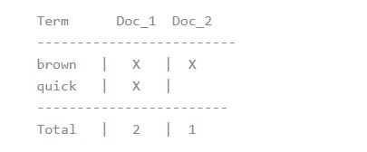
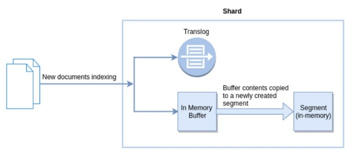

# ES的基本概念
## ES存储架构图


## 基本名词解释
- 文档（document）  
  - ES中的数据使用JSON的形式存储，每一个JSON数据称为文档（对应Mysql的每一行数据）  
  - 因为是用采用JSON形式存储，所以ES的文档支持动态的给文档增加新的字段（不需要像Mysql需要先写ddl语句去修改表结构）
  - ES默认给文档中的每个字段都建立索引，如果想节约空间，可以手动来设置索引  
  - 文档字段如果是字符串类型，ES默认不支持字符串类型字段的聚合操作，因为会消耗大量内存。所以ES会自动给字符串类型的字段增加一个keyword类型的子文档，keyword类型的字段可以进行聚合
  - 文档的type属性：在5.0之前索引中的文档可以支持多个不同的type，6.0之后只支持type=_doc。5.0之前支持设置不同的type是为了可以将一个索引当成库使用，不同的type作为不同的表来使用，后来ES官方认为这是一个不好的设计，因为索引已经是一个比较小的单位，将不相关的文档放在同一个索引中不合适，因此ES官方后续偏向于废弃type属性，但是目前还有保留
- 文档映射(mapping)  
  - mapping中记录了一个ES索引中的文档字段名称和字段值的类型，以及这个字段要使用到的分词器、过滤器等
  - 当插入一个新的文档时，ES会自动识别字段值的类型并添加到文档映射中，字段类型在被记录到文档映射中后，就不能更改了，只能通过重建索引(reindex)的方式来进行修改  
- 段(segment)  
  段一部分文档的集合
- 索引(index)  
  索引在ES中就是一张表，文档就是存储在索引中，ES支持给索引起一个别名，可以将多个索引视为一个索引
- 分片(shared)  
  - 一个分片中会存储一个索引的部分文档，索引在被创建时可以指定需要几个分片，索引中的每一个文档会根据文档的id hash到不同的分片中（类似于分库分表），hash算法是 hash(id) % 分片数量，因此索引在创建后分片的数量就不可以修改，否则同一个文档会因为分片数量变化导致hash值改变而出现在分片上查找不到的问题
  - 分片又分为主分片与副本分片，ES服务正常的情况下只会使用主分片，副本分片是作为高可用的一个保障，同一个分片的主分片与副本分片是不会存放在同一个节点上，当一个主分片所在的节点出现故障时，其他节点上这个分片的副本分片就会升级为主分片来使用
  - 由于一个索引的分片可以被存储到不同的节点上，这样的分布式存储有时候会为搜索、聚合带来一部分的问题（大部分有解决方法），如果我们在创建索引时，指定索引的分片数量是1，那么所有的数据都会存储在同一个分片上，可以规避一些分布式存储带来的问题，但是这样做也会失去分布式存储的优势
- 节点(node)  
一个ES节点就是一台服务器，当一个接收到某个文档的增删改请求时，如果这个文档经过hash后算出的分片不在这个节点上，这个节点会将这个请求转发给存储这个分片的节点
- 集群(cluster)  
一个ES集群中由多个es节点组成，客户端在访问集群时，可以通过一个代理服务器将集群当成一个服务使用


# ES的基础使用
客户端通过restfulAPI来对服务端进行操作 
## 增加
- 指定文档id  
```txt
put /index/type/id
{
    "name":"张三",
    "age":"18"
}
```
- 自动生成文档id
```txt
{
    "name":"李四",
    "age":"20"
}
```
- bulk 批量增加
  ```txt
  POST /index/type/_bulk
  { "index":{ "_id": "8a78dhkujg" } } }
  { "name":"john doe","age":25 }
  { "index":{} }
  { "name":"mary smith","age":32 }
  ```  
  在index中可以指定增加文档的id，也可以指定要插入的索引、type
## 更新
- 更新整个文档  
    ```txt 
    put /index/type/id
    {
        "name":"张三",
        "age":"19"
    }
    ```
    这种方式会直接将原来的文档修改成请求中的数据
- 部分更新
    ```txt
    post /index/type/id/_update
    {
        "doc":{
            "age":"20",
            "sex":"男"
        }
    }
    ```
    这种方式只会修改请求中涉及的字段，如果文档中不存在请求中的字段，则会添加字段到文档中


## 删除
```txt
delete /index/type/id
```
## 查询
### 精确查询(term)
```txt
post /index/_search
{
    "query":{
        "term":{
            "fieldName":fieldValue
        }
    }
}
```
term查询会查找出匹配字段fieldName中等于fieldValue的文档  

- 注意：  
  如果fieldValue这个字段有使用分词器等操作（ES默认会对字符串类型的字段进行分词），那么term查询则匹配的是分词后的结果  
  - 如，文档字段name = 李四，默认分词会将中文拆分成单独的字，也就是 [李、四]，此时term查询 name = 李，也可以查询出此文档  

  如果想对字符串字段做精确查询，可以设置字段为禁用分词器(not_analyze)或者使用keyword类型的字段来存储字符串
### 多个精确值的包含查询(terms)
```txt
post /index/_search
{
    "query":{
        "terms":{
            "fieldName":[fieldValue1,fieldValue2]
        }
    }
}
```
terms类似于 Mysql中的in，会将包含在数组内的文档都查出来
### 匹配查询(match)
```txt
post /index/_search
{
    "query":{
        "match":{
            "fieldName":fieldValue1
        }
    }
}
```
match会对字段分词后的结果进行匹配，查询条件中的值如果在分此后的内容中有出现，则会按照相关度排序后到结果集中
- 如match查询 name = 李五，索引中存在name=李五、name=李四的两个文档，并对name字段使用了默认的分词器将中文拆分为单独的字，此时的match查询会把这两条数据都查询出来，李五这条文档会排在李四之前，并且文档的相关度评分会比李四高  
- 如果字段没有经过分词器处理，那么match可以等价于term
### 范围查询(range)
```txt
post /index/_search
{
    "query":{
        "range":{
            "fieldName":{
                "gte":0,
                "lte":100
            }
        }
    }
}
```
range查询可以用于针对某字段做范围查询
- gt: > 大于（greater than）
- lt: < 小于（less than）
- gte: >= 大于或等于（greater than or equal to）
- lte: <= 小于或等于（less than or equal to）  

如果字段是日期类型，那么range也可以支持这样的查询
```txt
post /index/_search
{
    "query":{
        "range":{
            "fieldName":{
                "gte":"2022-2-10 00:00:00",
                "lte":"2022-2-11 23:59:59"
            }
        }
    }
}
```
### 分页(from+size)
```txt
post /index/_search
{
    "query":{
        "match_all":{}
    },
    "from":5,
    "size":10
}
```
- size表示要获取的结果集的大小
- from则是从匹配到的查询结果的第几条开始获取  

对于一些带有查询条件的聚合请求，只需要聚合后的结果，而不需要文档的内容，可以将size设置为0，减少文档数据的网络传输

### 字段是否存在查询(exists)
```txt
post /index/_search
{
    "query":{
        "exists":{
            "field":"fieldName"
        }
    }
}
```
### 组合查询(bool)
```txt
post /index/_search
{
	"query": {
		"bool": {
			"must": [
				{
				    "exists":{
				        "field":"age"
				    }
				},
				{
				    "range":{
				        "age":{
				            "gte":18
				        }
				    }
				},
				{
				    "match":{
				        "name":"李五"
				    }
				}
			],
			"must_not":[
			    {
			        "exists":{
			            "field":"sex"
			        }
			    }
			],
            "should":[
                {
                    "exists":{
                        "field":"addrss"
                    }
                }
            ]
		}
	}
}
```
bool提供了复杂查询的支持，可以同时使用多个查询条件来匹配数据
- must表示必须满足内部的查询条件
- must_not表示必须不满足内部的查询条件
- should是有满足条件则在结果集的排名更靠前（可以提高文档的相关度评分）
  
上面三个查询内部可以再嵌套bool查询以满足更复杂的查询
### 评分查询与过滤查询
ES中的查询分为两种：评分查询、过滤查询

#### 相关度评分
ES默认使用的查询方式就是评分搜索，也就是在查询文档时，除了文档需要满足查询条件外，还需要去给这个文档和搜索条件之间的关联度进行评分，评分后还要对结果集进行排序，评分结果会放入到_score字段，这个结果就是相关度评分  

#### 两者性能差距
过滤查询（Filtering queries）只是简单的检查包含或者排除，这就使得计算起来非常快。考虑到至少有一个过滤查询（filtering query）的结果是 “稀少的”（很少匹配的文档），并且经常使用不评分查询（non-scoring queries），结果会被缓存到内存中以便快速读取，所以有各种各样的手段来优化查询结果。

相反，评分查询（scoring queries）不仅仅要找出匹配的文档，还要计算每个匹配文档的相关性，计算相关性使得它们比不评分查询费力的多。同时，查询结果并不缓存。
#### 如何使用过滤查询
在查询请求中指定当前查询使用过滤上文下，es就会使用过滤查询来执行此次查询
```txt
post /index/_search
{
    "query" : {
        "constant_score" : { 
            "filter" : {
                "term" : { 
                    "field" : fieldValue
                }
            }
        }
    }
}
```
## 聚合
### 聚合相关名词解释
- 桶  
  桶就是满足特定条件的文档的集合（分组），类似于mysql中的group by sex  
  桶可以再嵌套一个桶，例如按照性别分桶后再按照年龄分桶  
  - 分桶注意事项（terms）  
    当需要根据某个字段分桶时，ES默认不允许对字符串类型的字段进行分桶，主要原因是ES担心字符串的字段非常大，会消耗大量内存与计算资源，因此如果要对字符串类型字段进行分桶，可以改为keyword类型。  
    如果不想调整为keywor类型，需要开启该字段的fielddata，ES会将这些字符串数据缓存到内存中，提高查询效率，开启了fielddata后，需要注意ES的内存消耗，fielddata内的数据在加载后只有根据最近最少使用策略来淘汰，也就是说一旦数据加入到fielddata后，供查询和聚合使用的内存就固定会减少这些数据大小，可以通过indices.fielddata.cache.size来限制fielddata的可以占用的内存空间大小
- 指标  
  桶将文档分到有意义的集合中，指标则是通过一些数学计算得到我们需要的文档计算结果  
  如计算男性用户有多少个人，类似于mysql中的 count(id)
### 总数
在ES中获取文档的总数有两种方法
- count API  
     ```txt
    post /index/_count
    {
	"query":{
	    "match_all":{}
	    }
    }
     ``` 
    这种方式可以查询出符合条件的文档总数
- 分桶后返回的doc_count(terms)
    ```txt
    post /index/_search
    {
	    "size": 0,
	    "aggs": {
		    "ageBucket": {
			    "terms": {
				    "field": "age.keyword",
                    "size":1000
			    }
		    }
	    }
    }
    ```
    terms分桶会会返回这个桶内的文档数量,terms中的size表示要对多少个匹配查询条件进行分桶，如果要计算总数量，size需要设置的比总数大（不推荐使用此方式来求总数）
### 求和(sum)
```txt
post /index/_search
{
    "size":0,
    "aggs":{
        "sumAgg":{
            "sum":{
                "field":"score"
            }
        }
    }
}
```
### 平均(avg)
```txt
post /index/_search
{
    "size":0,
    "aggs":{
        "avgAgg":{
            "avg":{
                "field":"score"
            }
        }
    }
}
```
### 最大、最小（max、min）
```txt
post /index/_search
//最大
{
	"size":0,
	"aggs":{
	    "maxScore":{
	        "max":{
	            "field":"score"
	        }
	    }
	}
}
//最小
{
	"size":0,
	"aggs":{
	    "maxScore":{
	        "min":{
	            "field":"score"
	        }
	    }
	}
}
```
### 统计(stats)
stats聚合会一起返回某个字段的文档总数、最小值、最大值、平均值、总和
post /index/_search
```txt
{
	"size": 0,
	"aggs": {
		"maxScore": {
			"stats": {
				"field": "score"
			}
		}
	}
}
```
### 直方图（histogram、date_histogram）
有时候我们想要按照字段的某个范围区间来分割桶，此时就可以采用histogram、如果字段是时间类信息则采用date_histogram  

比如我们想看考试成绩在0-20，20-40，40-60，60-80，80-100的人数分别有多少，这就是按照20分的范围来分割出不同的桶，人数就是桶的doc_count

```txt
post /index/_search
{
	"size": 0,
	"aggs": {
		"his": {
			"histogram": {
				"field": "score",
				"interval": 20,
				"extended_bounds": {
					"min": 0,
					"max": 100
				}
			}
		}
	}
}
```
默认的histogram聚合最小数值的桶只会根据已经存在的文档来展示，也就是说如果学生成绩都是80-100，那么前面的0-20、20-40之类的桶就不会展示，因此需要使用extended_bounds参数
- extended_bounds：显示直方图的最小值和最大值范围

# ES中的数据结构
## 倒排索引(inverted index)
在了解倒排索引之前，先了解一下普通的索引：普通的索引通常是根据ID快速的查找出内容，比如根据用户ID查找出用户的姓名。而倒排索引则和普通的索引相反，是根据用户的姓名快速的查找出用户的ID，和普通的索引查询的方向相反，因此取名倒排索引。  

es中，倒排索引的作用是用于搜索，比如我们要根据某个单词来搜索出对应的文档内容，此时就是根据倒排索引进行搜索  
倒排索引是一个列表结构，每个列表项有两个属性
- 单词项（Terms）：单词项是指将内容经过分词后得到的每个单词名，每个单词项在倒排索引中是唯一的
- 倒排列表（DOC_ID）：记录有出现上面单词项的文档ID

如果此时有两个文档，文档的content内容是：  
1. The quick brown fox jumped over the lazy dog
2. Quick brown foxes leap over lazy dogs in summer  
那么此时给content字段创建的倒排索引的数据结构如下图  
  

这时候，如果要搜索`quick brown`，那么倒排索引就可以很快的找出含有quick和brown的两个文档
  
并且因为倒排索引中的列结构一致，可以很快的发i西安Doc_1中quick和brown都含有，这样可以很容易的确定Doc_1的相关度会比Doc_2高，Doc_1优先展示
- ps：叫分词索引会比叫倒排索引更容易理解

## 词典(Doc values)
上面的倒排索引主要作用是用于搜索，根据某个值查找出文档。但是对于聚合而言，倒排索引就很难使用，比如需要根据某个字段分桶，如果使用倒排索引，需要先把单词项整合成完整的内容，再根据完整的内容进行分桶，这一部分又需要遍历所有的整合后的内容进行去重，性能非常差，因此需要一个新的数据结构来满足聚合功能，也就是词典  
词典也是一种列表结构，每个列表项也有两个属性
- 文档ID(Doc)：记录文档ID
- 单词项(Terms)：记录文档拆分后的每个单词  
  
词典的存储结构和倒排索引正好相反，还是用上面的例子：
如果此时有两个文档，文档的content内容是：  
1. The quick brown fox jumped over the lazy dog
2. Quick brown foxes leap over lazy dogs in summer  
  
那么content字段建立的词典如下图：
  
这样，如果要对字段进行分桶时，只需要获取所有的Terms，然后求交集即可。并且对于sum、max、min、histogram等都可以高效的完成。  
- 另外，词典不仅仅只使用于聚合，任何需要查找某个文档包含的值的操作都必须使用它，还包括排序，访问字段值的脚本，父子关系处理等等

# ES文档更新过程
上面了解了ES内的数据结构后，再了解一下ES文档的更新  

## 倒排索引的不变性
倒排索引有一个特点：`不变性`，倒排索引一经创建就不能再更改
不变性的好处如下：
- 不需要锁。如果你从来不更新索引，你就不需要担心多进程同时修改数据的问题。
- 一旦索引被读入内核的文件系统缓存，便会留在哪里，由于其不变性。只要文件系统缓存中还有足够的空间，那么大部分读请求会直接请求内存，而不会命中磁盘。这提供了很大的性能提升（不变性的主要原因）。
- 其它缓存(像filter缓存)，在索引的生命周期内始终有效。它们不需要在每次数据改变时被重建，因为数据不会变化。
- 写入单个大的倒排索引允许数据被压缩，减少磁盘 I/O 和 需要被缓存到内存的索引的使用量。  
  
## 针对不变性的更新改进
- 不变性的弊端  
  不变性的弊端也很明显，如果对文档的某个字段建立了倒排索引，当增加文档、更新文档时，只能将倒排索引先删除，再重新根据所有文档建立倒排索引。当文档数量多时，更新的性能将会非常差。 
 
ES对倒排索引的更新性能改进方法：将所有的文档分`段(segment)`存储，倒排索引也分段建立。ES中的倒排索引不是针对所有的文档建立，而是针对一小部分的文档建立一个倒排索引，这一小部分文档就称为段，当新增、更新文档时，只需要重新建立这个文档所在段的倒排索引即可

## 文档的详细更新（新增）过程

上面了解了`段`这个概念，已经为什么要有段的存在后，再来说一下文档的更新过程
- refresh  
  1.在向ES写入数据时，ES没有直接将更新写入到磁盘中，而是先记录到In memory buffer和Translog日志（日志用于防止ES重启更新丢失）中，此时的修改记录在in memory buffer中，在in memory buffer中的数据不会被ES搜索到  

  2.refresh就是新建一个segement，将ES记在in memory buffer中的文档写入到segement中，此时在segment中的文档就可以被搜索，使用refresh的原因是为了提高ES每次in memory buffer → segment的数据量，先记录到内存中的segment原因是 磁盘写入速度慢，先记录到内存中，那么数据可以被更快的搜索到

  3.默认的refresh间隔是1s，refresh比较消耗资源，官方建议等es自己的固定时间进行refresh，而不是手动触发refresh，es的get请求默认会先触发refresh再查询（如果在文档大量更新的情况下发送get请求，可能会因为refresh导致get请求超时）
- flush  
  es每隔一段时间，会把内存中的segment持久化到磁盘中，这个过程叫flush
- 段合并  
  由于refush流程每秒会创建一个新的段，这样会导致短时间内的段数量暴增。 每一个段都会消耗文件句柄、内存和cpu运行周期。并且每个搜索请求都必须轮流检查每个段；所以段越多，搜索也就越慢。  
  Elasticsearch通过在后台进行段合并来解决这个问题。小的段被合并到大的段，然后这些大的段再被合并到更大的段。  
  段合并时还会顺带着删除旧的已经被标记为删除的文档（ES中发出删除文档的请求后，并不会立刻删除，而是给文档打上一个要删除的标记），因为被标记的文档在段合并时不会被合并到新的大的段中，而原来的小段在合并后就会自动删除。


# ES的分布式搜索过程
## 分布式的查询
ES的查询过程分为两阶段：
### 1.Query阶段
在第一步中，首先客户端向ES集群中的某个节点发送查询请求，接收到这个请求的节点称为协调节点，协调节点接收到查询请求后，协调节点会创建一个大小为from + size的优先队列，然后将请求同步转发给其他的节点一起查询，每个节点（包括协调节点）会创建一个from + size的本地优先队列，然后将满足查询条件的文档ID和排序需要用的字段添加到本地优先队列中，然后将队列发回给协调节点，协调节点对所有返回的数据进行整合排序
### 2.Featch阶段
在对所有的数据整合排序后，协调节点会决定是否要去获取文档的所有内容（比如根据from+size的参数，舍弃前80个文档），决定后协调节点就会对其他节点发送muti get来获取文档的所有内容，将文档从ID丰富成客户端需要的文档内容后，协调节点就会将数据返回给护短端

## 分布式的聚合过程

# ES的高阶使用
## es脚本（script）
es的script可以让我们像写程序代码一样来查询、修改es中的数据
- 脚本使用的语言是es自己开发的painless，类似于java，支持lambda表达式  
  
下面举两个简单的例子来了解script的使用
- 通过painless查询


## 分词器
## 过滤器
## 高级搜索
## 提高相关性
## 建议

# ES的数据建模
# ES集群监控管理