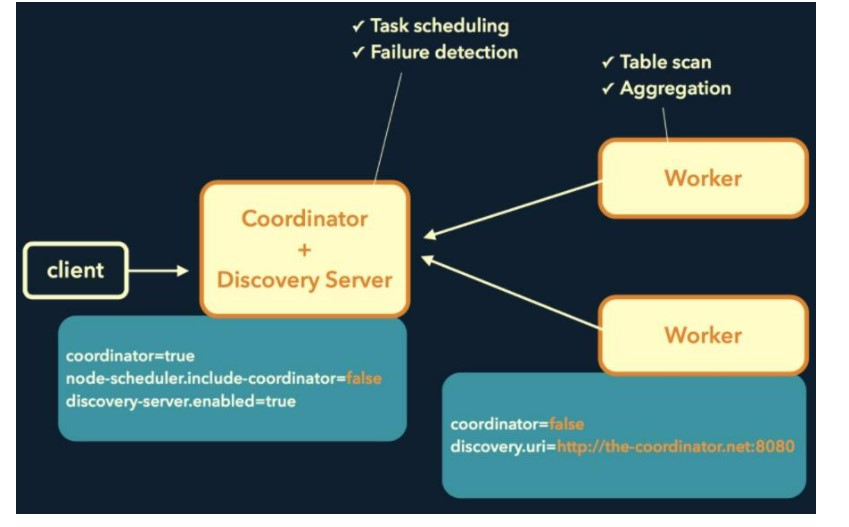
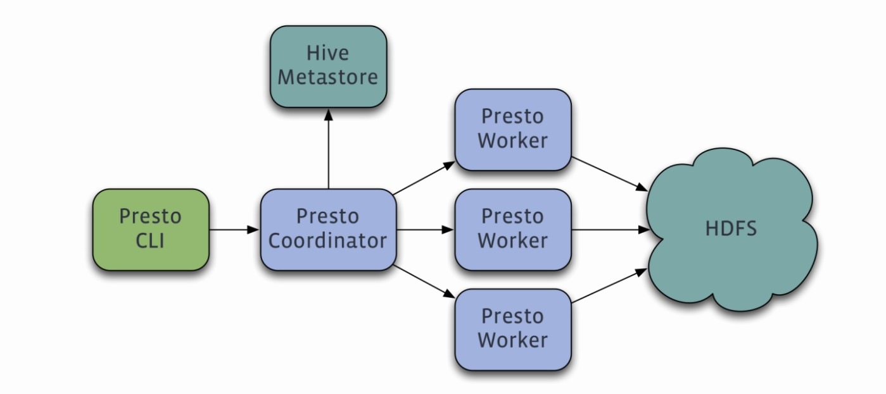
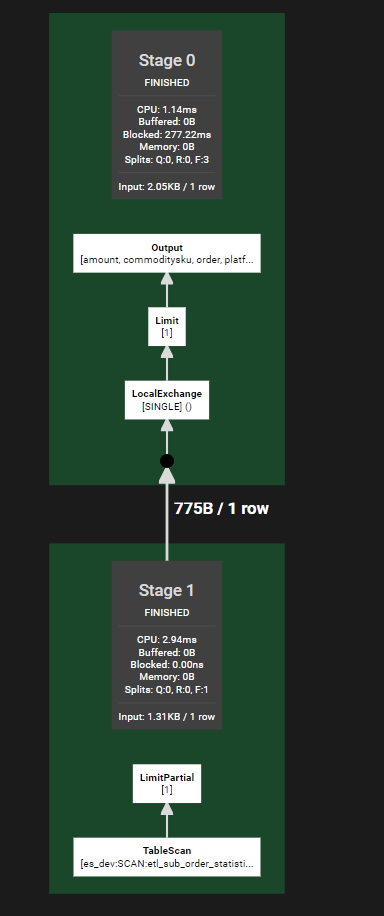
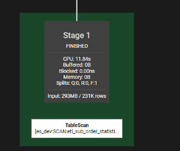
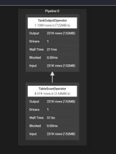

# Trino简介

Trino 是一种分布式 SQL 查询引擎，旨在查询分布在一个或多个异构数据源上的大型数据集

| 官网 https://trino.io/docs/current/overview.html
# Trino历史

最早由Facebook公司开源了PrestoDB项目，PrestoDB最初的目的是为了解决Hive查询速度慢的问题，后面PrestoDB项目的创始团队离开了Facebook并创建了PrestoDB的一个分支叫PrestoSQL,并全职服务于PrestoSQL。
后面两个分支分家，Prestodb贡献给了linux基金会，PrestoSQL则自己建立了一个基金会。
再后来Facebook注册了Presto的商标，PrestoSQL改名叫Trino。

| PrestoDB与Presoto活跃度对比 https://zhuanlan.zhihu.com/p/87621360
| trino仓库 https://github.com/trinodb/trino
| presto仓库 https://github.com/prestodb/presto
# Trino架构
## 部署图

Trino服务端中有3个角色
 - Coordinator：接收来自客户端的请求，构建执行任务，然后分配给Worker执行。
 - Worker：实际执行查询任务
 - Discovery Server：类似于Doubble的注册中心。在Trino中优先启动，Coordinator与Worker启动后向Discovery Server注册信息，Trino正式开始工作。Discovery Server通常内嵌在Coordinator机器上。

## 架构图

 Presto是一个Master-Slave架构，一个Coordinator，多个Worker。Coordinator负责解析SQL语句，生成执行计划，分发执行任务给Worker节点执行；Worker节点负责实际执行查询任务。Presto提供了一套Connector接口，用于读取元信息和连接原始数据库
# 一些Trino中的概念
## Connector
Trino用来与数据源连接的驱动
## Catalog
数据源

## Scheme
数据源中的某一个库
（使用Presto连接es时，由于es中只有表，所以Presto给es提供了一个默认的Scheme叫default）

## Table
数据库中的表

## Stage
Coordinator接收到SQL查询请求后，会将一个SQL语句分为多个Stage并行执行

比如这一句sql ：select * from es_dev.default.etl_sub_order_statistic limit 1

被拆分为两个stage：stage1 扫描表获取数据，stage0对stage1扫描结果 获取limit条数的数据并输出结果（stage0中有一个Limit1是presto的下推优化，把sql语句能交给数据源执行的都优先让数据源执行）

## Exchange
Stage与Stage之间的数据交互区，像上图的Stage0与Stage1就有依赖Exchange

## Task
Stage由一个或多个Task组成，Stage只负责对Task进行建模，真正执行的是Task

## Split
Split是要查询的表的一个分片，每个Task处理的对象就是Split

## Driver
Task还会被拆解成一个或多个Drvier，以并行的方式执行多个Driver来实现Task的并行执行。一个Driver处理一个Split，Driver的输出由Task收集并传递给下游的Stage中的Task

## Page
Page是Trino中的最小处理单元，一个Split由多个Page组成
Operator

Operator表示对Split的一种操作，比如过滤、转换、输出数据等。一个Driver就是一系列Operator的集合。Operator每次读取Spilit的一个Page，并进行输出

## Pipeline
每个Stage会有很多个Operator，Tride会将合适Opertator编排成一个Pipeline，Pipeline内部的Operator的并行度相同，Plipeline的并行度就是Drive的个数。并且Pileline中的Operator之间的数据交互是本地交互

  

  

上图中是 `select * from es_dev.default.etl_sub_order_statistic` 这句SQL的第1个Stage:TableScan，扫描表，内部只有一个Piepline，Piepline内有两个Operator，一个是扫描表的Oprator另一个是将表数据进行输出的Operator。并且Piepine只有一个Driver，也就是Operator的并行度是1

# SQL拆解的基本原理

比如这样一句SQL：

select * from A join B on A.id = B.id

可以拆解成十条SQL并行执行

for K in range [0, 10){

select * from A join B on A.id = B.id where B.id % 10 = K

}

然后再一起汇总输出
# 实现低延时的原理

完全基于内存的并行计算

流水线

本地化计算

动态编译执行计划

小心使用内存和数据结构

类BlinkDB的近似查询

GC控制

（具体信息可以查看：Presto实现原理和美团的使用实践 https://tech.meituan.com/2014/06/16/presto.html ）

# Trino的使用场景
1.需要高效查询大量数据（TB、PB级别）的情况  

这种情况通常会使用Hadoop，Presto可以加快HiveSQL查询

2.进行数据分析，需要汇总大量数据、跨多个数据源的情况

Presto提供跨数据源的SQL JOIN方式来进行数据分析、汇总

3.ETL

对于支持写操作的Conector，Trino可以提供使用SQL进行ETL的方式，比如数据仓库中需要定时根据SQL从明细表生成汇总表、或者需要将mongo的数据迁移到mysql 那么可以用类似下面的SQL进行ETL

INSERT INTO table
    SELECT ...
    FROM ...
    JOIN ...

## Trino的实际应用场景

美团：采用Presto来加快对HiveSQL查询，用来支撑对实时查询的需求

滴滴：公司首选Ad-Hoc查询引擎及Hive SQL加速引擎

- Ad-hoc查询：即席查询。即席查询和普通的查询在SQL语句上没有区别，主要区别是：通常的查询会在系统中事件建立好索引、库表分区等优化措施，查询速度通常比较快；即席查询则是临时的一些查询需求（比如教务突然要导出一些什么数据），系统没有做事先的优化，查询速度可能比较慢  （百度百科-即席查询  https://baike.baidu.com/item/%E5%8D%B3%E5%B8%AD%E6%9F%A5%E8%AF%A2/2886987?fr=aladdin ）

哔哩哔哩：Presto主要承担了AD-HOC查询、BI查询、DQC(数据校验，包括跨数据源校验)、AI ETL作业、数据探查等场景

参考资料：

https://www.bilibili.com/read/cv16043517 Presto在B站的实践

https://armsword.com/2020/11/03/presto-in-didichuxing/#more Presto在滴滴的探索和实践

https://tech.meituan.com/2014/06/16/presto.html Presto实现原理和美团的使用实践
# Trino SQL查询功能体验

Presoto的SQL查询方式：

select * from mysql_dev.project_jiuquan_fjzj.uml_user;

与普通的SQL唯一的差异点就是在表名前面需要增加catalog和scheme的名字

## Trino对嵌套对象的支持：

在Trino中会将嵌套对象视为ROW类型（一个JSON字符串），访问ROW对象的方式是ROW对象[字段下标]。比如ES etl_sub_order_statistic这个索引中commoditySku

比如我们要访问commoditySku中的commoditySkuId，表达式为 commoditySku[1]（下标从1开始），如果还要访问嵌套对象内的嵌套对象比如商品的年度SKU属性，那表达式就是commoditySku[1][1]；

- 可能带来的问题：当我们在嵌套对象内新增字段或者删除字段，原有的SQL就需要一起调整

## 原生数据库查询VS通过Trino进行查询
### Navicat对Mysql直接查询VS通过Trino对Mysql查询
#### 普通查询速度对比

select * from project_jiuquan_fjzj.uml_user_object limit 5000

- 通过Navicat直接查询：82ms
- 通过trino查询：202ms
#### 简单聚合速度对比

select count(*) from project_jiuquan_fjzj.uml_user_object

- 通过Navicat直接查询：55ms
- 通过trino查询：125ms
#### 分组聚合速度对比

select count(*) from project_jiuquan_fjzj.uml_user_object group by USR_OBJECT_ID

- 通过Navicat直接查询：72ms
- 通过trino查询：251ms
## Postman对ES直接查询VS通过Trino对ES查询
### 普通查询速度对比

select * from es_dev.default.etl_sub_order_statistic limit 1000
- 通过Postman对ES发起查询请求：186ms
- 通过trino查询：367ms

简单聚合速度对比

select count(*) from es_dev.default.etl_sub_order_statistic
- 通过Postman对ES发起查询请求： 183ms
- 通过trino查询：361ms

分组聚合速度对比

select count(*) from es_dev.default.etl_sub_order_statistic group by projectId

- 通过Postman对ES发起查询请求：49ms

- 通过trino查询：17.47s

### HiveSQL查询 VS TrinoSQL查询

（引自美团数据）

Presto比hive快5倍左右

# 跨数据源关联查询
Mysql关联查询ES

1.普通查询

select * from mysql_dev.project_jiuquan_fjzj.uml_user as aa join es_dev.default.etl_sub_order_statistic as bb on aa.prm_id = bb.projectId 

- 如果直接这样查询，Trino的内存使用会一直增加，最后会抛出内存溢出；因为对于Join操作，Trino需要消耗大量内存去保存数据，数据量大的情况下Join需要加上limit限制；

2.聚合

select aa.prm_id,count(*) from mysql_dev.project_jiuquan_fjzj.uml_user as aa join es_dev.default.etl_sub_order_statistic as bb on aa.prm_id = bb.projectId group by aa.prm_id

正常执行，只消耗了16mb内存
总结：

1.Trino最早的设计初衷是想对Hive的查询加速，实践来看将Trino用于单个数据源的查询，除了Hive外，Mysql和ES查询速度都没有直接用数据源对应的客户端查询快；但是对于一些比较复杂的SQL查询，Trino会将SQL拆解，并将数据暂留在内存中，此时Trino的查询速度可能更快

2.Trino 对于select *这样的操作，如果加上Join，Trino需要消耗比较多内存去保存数据，内存占用过大会导致查询失败，这时候可能需要用offset+Limit来分页查询