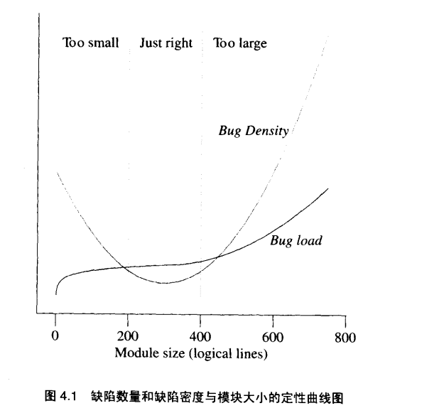
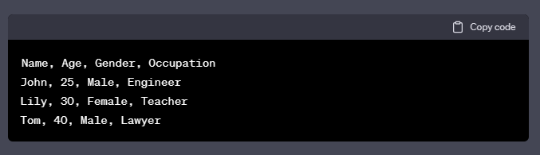
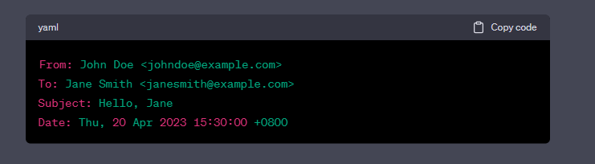
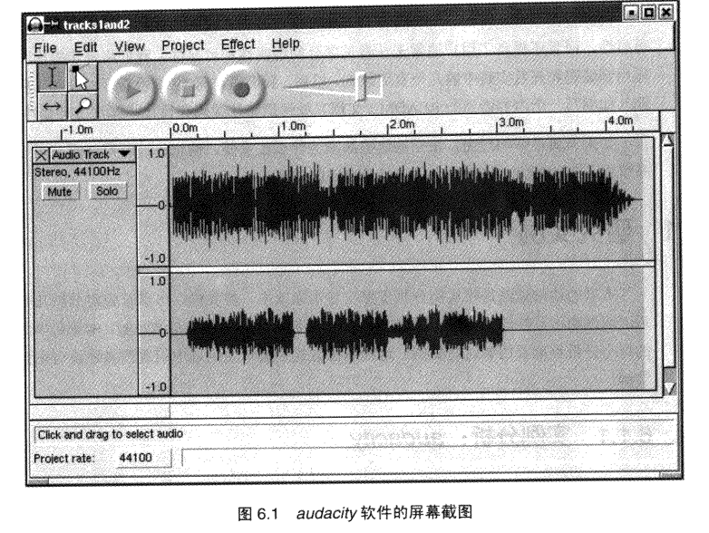

# 概述
这本书主要讲述了关于Unix系统的发展历史，Unix的文化，Unix系统内部的编程技术，Unix的软件设计思想。虽然这本书距离现在已经有些年头了，但是书中还是有许多值得学习的地方，即使不是Unix软件编程人员。

# 中心思想
我认为这本书的中心思想是把编程视为艺术，而这个艺术的核心就是：简洁与美。  
通过讲述Unix的各个设计思想以及多个相关软件实例，来带领大家深入理解编程的艺术：模块化、简洁性、可读性，体会编程的美。  
引用书中的Unix核心原则来概括这本书的中心思想：Keep It Simple,Stupid。无论是从用户界面、软件设计还是程序代码，尽量保持程序的简洁，用追求艺术的态度来编程。

# 每章小结
## 一.哲学
这是这本书的第一章，介绍了Unix在操作系统发展历史中的优势与劣势，并统一概述的软件编程中的各个原则以及简要介绍原则的内容。  

### Unix得与失
Unix系统与其他的操作系统比较起来，Unix是开发人员设计给其他技术人员使用的一种系统，它讲究策略（目的）与机制（实现）分离，在Unix中提供了许多的机制、各个灵活的可选项来给系统的使用人员，使用人员可以自己给操作系统设计软件，这里的策略是指目标，机制则是达到这个目标的实现过程。因此Unix在技术人员中非常受欢迎，广泛应用于服务器、超级计算机等处。  
然而过于灵活的机制，也导致Unix失去了非技术的用户，当用户设定好了策略，可以自己选择机制时，也意味这用户必须要自己选择机制，而Unix中五花八门的接口、命令等会导致用户趋向于选择更简洁的操作系统。  
但是，从长远来看，用户的策略相对而言更容易发生改变，而机制则相对来说更为稳定，有许多被束缚在同一套机制与界面中的操作系统已经消失在历史的长河，而Unix系统的流传至今。


### Unix哲学原则  
- Keep It Simple,Stupid  
KISS原则：保持简单与愚蠢。把这个原则排在第一位是因为这个原则是本书作者认为可以直接代表整个Unix编程哲学。这个原则旨在让事物容易理解、使用、维护，过度复杂的设计会增加出错的概率，降低可维护性和易用性。在软件编程方面，则意味着开发人员应当尽量采用简单直接的方法来解决问题，避免不必要的复杂性、重复、冗余，提高软件的可读性、可维护性、可扩展性。  
- 模块原则：使用简洁的接口来拼合简单的部件  
计算机的本质就是控制复杂度。要编制复杂的软件而又不至于一败涂地，唯一的解决方法就是降低整体复杂度：用清晰的接口把简单的模块组合成一个复杂的软件（无论是）。如此一来，多数的问题只会被限制在一个小的局部，以及对局部进行改造也不至于牵一发而动全身。  
从项目管理上看模块化还可以更好的拆分工作量，更好的促进团队协作，提升开发效率。  
- 清晰原则：清晰胜于技巧  
编程中，需要记住：我们写的代码并不是给计算机看的，而是给人看的，包括自己以及以后可能会维护这份代码的人。如果为了取得一点点的性能提升，而导致软件复杂度大幅提高、代码晦涩难懂，不仅仅容易滋生bug，日后的阅读和维护也更为艰难。  
- 组合原则：设计时考虑拼接组合
该原则旨在提倡分离不同职责的程序，程序与程序之间通过有效的通信来组合，从而降低软件复杂度。  
在程序的通信方面，unix极度提倡使用文本流来进行通信，文本流最大的好处就是简洁与通用，程序将一个文本流处理成另一个文本流。而且如果需要组合程序，那么就需要保持程序的独立性，程序的输入与输出，尽量不去考虑另一端的程序。  
如果一个程序不能分离成不同的子程序，那么至少也应当编写一套API，将API链接调用来组合程序。
- 分离原则：策略与机制分离、接口与引擎分离  
首先明确原则中出现的名词的含义：  
  - 策略：指一个通用的逻辑过程，是一个比较高层的目标。比如排序、搜索等比较通用的概念。
  - 机制：指实现一个策略的具体实现过程。比如我们要实现排序这一策略，可以选择用冒牌排序来实现。具体的实现就是机制。
策略与机制分离就是将实现特定功能的逻辑与具体的实现分离。比如我们想对数组进行排序，我们可以选择不同的机制来达到策略。  
  - 接口：在软件系统中，让外界与系统进行交互的地方称为接口，比如UI界面、API等。  
  - 引擎：一个系统处理逻辑的实现，比如系统内的数据结构、算法等。
接口与引擎分离就是用户界面与系统实现分离，将用户界面与业务逻辑解耦，两边可以独立修改，提升软件的可维护性，可扩展性。比较常见的web应用的前后端分离也体现了该原则的作用。  
- 简洁原则：设计要简洁，复杂度能低就低  
程序员往往会以玩转复杂的东西和非常抽象的概念为傲，但是往往过度的复杂导致软件臃肿不堪、bug极多，最后只会走向失败。程序员应当以简洁为美。  
- 吝啬原则：除非却无它法，不要编写庞大的程序  
这里的庞大是指，程序体积大（可以简单理解成代码行数），复杂程度大。  
- 透明性原则：设计要可见，以便审查和调试  
有效减少程序的调试时间的方法之一就是设计时充分考虑透明性与显见性。透明性是指一眼就可以看出系统在做什么以及怎么做的。同时显现性指程序带有监视和现实内部状态的功能，这样程序不仅能运行良好，而且还能看得出来程序在如何运行。  
- 健壮原则：健壮源于透明与简洁  
软件的健壮性指软件不仅能在正常情况下运行良好，而且在超出设计者设想的意外条件下也能够运行良好。  
大多数软件毛病多，经不起磕碰，主要原因就是过于复杂，很难从全方面的考虑问题。想让程序健壮，主要有两个方法：透明与简洁。  
软件的透明可以帮助我们一眼就能看出程序是怎么回事。而如果人们不需要较劲脑汁就可以推断出所有的可能的情况，那么这个程序就是简洁的。程序越简洁就越透明也就越健壮。  
另外模块性也可以帮助程序变得更为简洁。  
- 表示原则：把知识叠入数据以求逻辑质朴而健壮  
让人类来验证程序逻辑是比较困难的，但是如果是很复杂的数据，对人类来说还是比较容易能够推导和建模的。  
是以一个Map来进行数据转换更清晰还是写50行的switch语句清晰呢？想必一定是Map吧。数据要比编程逻辑更容易驾驭，在设计中，应当主动把代码的复杂度转移到数据之中。  
- 通俗原则：接口设计避免标新立异  
这个原则也称为最少惊奇原则。最容易使用的程序就是用户需要学习新东西最少的程序。接口设计上应该避免毫无缘由的标新立异。比如设计一个计算机程序“+”号应当永远表示加法，尽量按照用户最熟悉的同样功能接口来进行设计。  
- 缄默原则：如果一个程序没什么好说的，就保持沉默  
将用户的注意力视为一种宝贵的资源，如果程序没有什么好输出的，那么就应当保持沉默。  
- 补救原则：当软件出现异常时，马上退出并给出足量的错误信息  
软件发生错误时，最理想的情况是软件能够应付这种非正常操作，并继续保持良好的运作。但是如果补救措施不成功，那么不应当让程序继续运行，尽可能以容易诊断错误的方式终止。  
许多框架的fail-fast机制，也是尽可能早的停止程序并将错误信息输出。  
- 经济原则：宁化机器一分，不花程序员一秒  
在如今，机器的硬件配置价格已经非常低价，大多数应用场合都应该采用Per、Java这类可以自动管理内存的语言，解放程序管理内存的负担  
- 生成原则：避免手动编码，尽量编写程序去生成程序  
人并不擅长去做辛苦的细节工作，手工的去处理一些文件程序，很容易滋生错误，而由程序生成代码总是比手写代码更值得信赖。  
- 优化原则：雕琢之前得先有原则，跑之前先学会走  
做好原型设计可以帮助我们避免为蝇头小利而投入过多时间。先设计一个未优化的、运行缓慢、很耗内存但是正确的实现，然后在进行系统调整，寻找那些可以牺牲最小的局部简洁性而获得较大性能提升的地方。  
- 多样原则：决不相信所谓“不二法门”的断言  
不要相信任何的“不二法门”
- 扩展原则：设计着眼于未来，未来总是比预想快
尽量在设计时，留下可以扩展的空间。比如稍微增加一些自描述性的开销，就可以在无需破坏原有整体的情况下进行扩展。如在接口中版本号、文件名中增加后缀之类自描述。


### Unix哲学一句话总结
一个程序只做一件事，并做好。程序之间要可以协作。程序要可以处理文本流，这是最通用的接口。  
应用到java中，我的理解是这样：一个接口、一个类、一个模块、一个微服务都只做它职责范围内的事，即单一职责原则。各个模块之间通过互相协作来实现整体软件的目的，各个模块之间的通信由文本来进行传输。  
还有以追求艺术的态度来编程。

## 二.Unix历史
忘记过去的人，注定重蹈覆辙。这一章回顾了Unix的发展历史，了解一个软件的发展历程也许会对我们未来设计软件带来帮助。Unix系统诞生于1970年，最初由汇编语言和B语言编写，而后又使用了C语言重写，使用高级语言来改造对于Unix的广泛传播功不可没，操作系统代码的可读性、可维护性、可移植性都有了巨大的提升。Unix系统在经过广泛发展也离不开其开源代码，在技术界有许多人研究Unix并改造Uix。而后Unix引起了许多商业公司的注意，由商业公司经手改造并收购版权等操作后，Unix此时已接近闭源，再加上Windows系统Mac系统的竞争，Unix系统开始走向没落。而后Linux系统横空出世，Linux系统继承了Unix系统的设计思想、编程风格并且开源，对世界产生了巨大的影响。最后总结一下Unix发展规律：离开源越近，Unix越繁荣；离开源越远，越衰弱。

## 三.Unix系统与其他系统比较
### 统一性理念
统一性理念是指在某个组织、团队或个人中，存在着一种追求整体和谐、统一和完美的理念。  
在Unix系统中有几个统一性理念，其中最重要的是“一切皆文件”和在此基础上建立的管道概念。这些理念来源于Unix系统的设计者，并且这些理念会渗透到Unix系统的API，Unix系统上开发的工具等各个地方。优秀的软件应当存在一些统一性理念。  
在Unix中还存在以下一些统一性理念：  
- 多任务处理能力：Unix系统拥有同时进行多个进程的能力，通过抢占式多任务的设计，将CPU的时间片交由一个调度程序控制，这个调度程序定期或者抢断地将CPU控制权交给下一个程序控制。  
- 协作进程：在Unix中，进程的生成代价低、进程间互相通信便捷，更推崇使用众多小工具和管道来组合成一个均衡的系统，而不是一个庞大的单体应用。  
- 内部边界：在Unix中，有一套准绳：程序员最清楚一切。所以当你执行rm -rf *时，Unix不会提示你任何信息，而是直接执行。但是Unix会注重你只能操作你有权操作的那部分数据，也就是做好系统内部边界的划分，尽量做到可以只分配给用户最小需要的操作权限，用于保护系统的安全。  
- 文件属性和记录结构：在Unix中文件系统中的文件既没有记录结构也没有文件属性，文件本身只是一个数据结构，不包含文件系统结构或者属性的信息。作者认为操作系统级的记录结构只是一个优化手段并且会导致API和程序员编程复杂之外，没有别的用处。而文件属性虽然可以记录文件的创建时间、最后修改时间、大小等有用的信息，但是在这个文件移植到其他系统等场景时，可以会碰到不兼容的语义问题，而且会诱导程序员将文件属性和能读懂这个文件属性的解密程序绑定到一起，将文件变得不透明。（但是我个人认为文件属性还是利大于弊吧，有一些文件的元数据，可以提供更好的便利性。至于兼容性的问题，可以模仿jvm的思路，针对不同的操作系统生成不同的文件属性）。  
- 首选用户界面风格：不同的操作系统会有不同的首选用户界面。在Unix中GUI没做好是一个巨大的问题，同样：CLI没做好也是一个巨大的问题。一个没有CLI的操作系统存在的问题：  
  1. 远程系统管理难于实现，需要更多的网络（这一点，在现在的网络速度，不是什么问题）  
  2. 简单的程序也需要引入GUI、复杂的脚本
  3. 服务器、守护程序、后台程序很难用优雅的方式写出数据  
- 目标受众：不同的操作系统设计是为了适应不同的目标手中，有的为后台工作设计，有的设计为桌面系统。有的为技术用户设计，有的为最终用户设计。Unix是技术人员设计给技术人员的，并提供一套机制给目标用户达成他们的策略。Unix返回将操作系统设计为一个自认为比用户还懂用户要做什么的系统。  
- 开发门槛：Unix强调轻松编程，Unix提供简单的API、廉价的工具而且Unix本身内置了编译器、脚本工具等方便程序员进行开发。一个轻松编程的环境可以产生许多操作系统工具和一个自我增强、不断扩展的社区，这对一个操作系统的发展十分重要。  
### 操作系统的比较  
这一小节介绍了许多操作系统，有一些操作系统已经消失在历史的长河里（介绍了好几个我没有听说过的操作系统），这里就简单讲下两个出名的系统 
MacOS：注重用户体验与GUI，在MacOS有一个坚定的统一性理念：Mac界面方针，这个方针详细的规定了每个程序GUI应该遵守的表现形式和行为规范，如果不遵守这个方针会立即遭到Mac用户的拒绝。
Windows：作者在这一章点评中非常看不起Windows，认为它没有统一性理念，核心理念没有扎根，每过一段时间就要发布新版本，其中需要理念就会过时。而且API复杂、不透明、没有提供一个轻松编程的氛围。  
Linux：作者认为Linux虽然没有Unix中的源码，但Linux是一个符合Unix风格的操作系统，并延续了Unix。想必这也是Linux在发布后没多久就壮大起来的重要原因，吸引了许多Unix和非Unix的程序员贡献代码。  
## 四.模块性：保持清晰、保持简洁  
要编写复杂软件又不至于一败涂地的唯一办法：用定义清晰的接口把若干简单模块组合起来，如此一来，多数问题只会出现在局部，那就还有机会对局部进行改进和优化，不至于牵动全身。在Unix中的传统是：更加笃信重视模块化、更注重正交性和紧凑型。
- 正交性：  
  在纯粹的正交设计中，任何一个操作都没有副作用，每个动作都只改变一件事，不影响其他。无论控制的是什么系统，每个改变系统属性的方法有且仅有一个。”只做好一件事“。
  还有一种对正交性的理解：
  模块之间互相独立和解耦。具体来说，每个模块只实现一项明确定义的功能，并且不依赖其他模块的具体实现
- 紧凑性  
  紧凑型就是一个设计是否可以装进人脑中的特性。测试软件紧凑型的一个好的方式：有经验的用户需要操作手册吗？如果不用，那么这个设计就是紧凑的。  
  还有一种对紧凑型的理解：    
  模块内部的各个元素紧密相关，共同完成一个明确定义的功能，而不是散乱无章、咋功能复杂。  
  一个高度紧凑的模块会具有以下特点：  
  1. 一个模块只实现一个明确的功能
  2. 模块内部各个元素之间的关联程度高，批次互相依赖  
  3. 模块内部的功能实现清晰明确，不涉及到其他模块的功能  
  4. 模块内部的遍历和函数都是在同一上下文中  
### 封装与模块化原则
想讲代码模块的首要特质就是封装，一个封装良好的模块不会想外透露过多自身实现细节，不会去直接调用其他模块的实现代码，也不会胡乱共享全局数据。模块之间通过一组严密、定义良好的程序调用（API）和数据结构来通信。这两点也就是模块化原则的内容。  
### 模块的最佳大小  
模块分解的越彻底，每一块就越小，API的定义也就越重要。全局复杂度和受BUG影响的程度也会降低。但是模块划分的太小也可能导致bug数上升。  
  
模块非常小时，几乎所有的复杂度都在于接口，想要理解任何一部分代码前必须要理解全部代码，因此阅读代码非常困难。按照经验表明，**一个最佳的模块大小是200到400的逻辑行**，模块实际代码行数可以按照两倍逻辑行来估算，即一个模块的最佳代码行数在400到800。  
### SPOT原则
Single Point of Truth,真理的单点性。意思是说任何一个知识点在系统内部都应当有一个唯一、明确、权威的表述。类似这个思想的原则还有一个：Don't Repeat Yourself.知识点（代码）在两个地方重复会导致前后矛盾，产生隐微问题的代码，原因是当我们修改重复点时，经常只会修改某一处的代码而不是全部。这也意味着对代码的组织没有考虑清楚。
### 软件的多层
#### 自底向上、自顶向下、胶合层
- 自底向上：从具体到抽象。从问题与中先确定具体的操作，向上进行，再尝试抽象。  
- 自顶向下：从抽象到具体。先从最高层面描述整个项目的规格说明，向下进行，直到各个具体的操作。  
在以下三个条件都满足时，自顶向下会是一个好办法：  
1. 能精确预知程序的任务  
2. 在实现过程中，程序规格不会发生重大变化  
3. 在底层，有充分自由来选择程完成任务的方式  
这三个条件比较容易在接近最终用户的软件设计-应用软件编程中得到满足，所以目前大多数的程序员都会选择使用自顶向下来进行设计编程。而相对较底层的设计者可能会选择自底向上，他们往往不容易满足以上三个条件。但是其实在实际编码中会尽量选择双管齐下：一边抽象程序的表达规范，一边去实现程序底层的逻辑，然后通过一个**胶合层**将两者融合起来。  
- 胶合层  
当程序的自顶向下和自底向上发生冲突时，其结果往往是一团糟，所以必须依赖一个胶合层来缓冲两者的冲突。胶合层用来将东西粘到一起，为了缓冲两者的冲突往往会发生许多改动，必须尽量保持薄，而且不能用于隐藏其他层的问题。有一个优秀的薄胶合层的例子：C语言，C语言作为底层的编程语言将硬件和软件粘合在一起。C语言可以在不同的硬件平台上编写底层代码，而上层软件使用C语言可以屏蔽这一方面的差异，软件只需要做软件要做的事情，而硬件也只需要做硬件的事情，顶层软件和底层硬件操作分离。  
#### Unix和面向对象
本书作者对于面向对并不是完全的肯定，他认为面向对象推崇使用一个”厚重的胶合层和复杂的层次“，当一个系统非常复杂、确实需要大量抽象时，使用面向对象是一个好事，但是如果用复杂的方式去做一个简单的事，那这是得不偿失的。许多面向对象的语言会诱使程序员陷入过分分层陷阱，过多的层次破坏了透明性，很难一眼看清代码到底是怎么运行的。简洁、清晰、透明原则统统被破坏了，代码中充满了晦涩的bug，始终存在维护问题。  
**如果你知道自己在做什么，三层就足够了；如果你不知道自己在做什么，十七层也没用**
目前java web系统大多采用的mvc三层架构，在架构上其实并没有使用到面向对象，而是面向过程，将Service层作为M和V的胶合层，可能只有在具体的某个系统功能上体现了面向对象的思想，系统整体实现上还是面向过程。

## 五.文本化：好协议产生好实践
这一章主要介绍了文本化在Unix系统中的重要性与一些取得成功的文本化协议。  
### 文本化VS非文本化
这里的文本化指程序之间的使用人类可以识别的文本内容来进行交互，人无需专门的工具有可以看懂和编辑内容，是透明的。文本化还具体较好的扩展性，其中一个例子就是文本格式范围不会去表示数字的范围，而二进制格式通常需要指定某个值的分配位数，比如IP协议，IPv4的地址是32位，为了将地址位数扩展到128位（IPv6）整个协议就需要大改，而文本格式下需要更大的值直接填写即可，也许某个程序不能接收协议中出现的更大的值，但是和修改整个协议来比，修改单个程序就简单多了。使用二进制协议的唯一正当理由就是需要大批量的处理数据，非常关心数据传输速度，需要提高数据的传输密度，或者非常需要提高将数据转换为可以使用的数据结构或者芯片的指令开销的时间。
### 文本格式例子  
这边简单讲几个文本格式的例子  
- DSV风格：使用特定的分隔符来分割各个值的一种数据文本化表达方式  
    
- RFC822格式：使用于邮件系统中，RFC822格式的邮件消息由两部分组成：消息头和消息体。消息头包含邮件的元数据，如发件人、收件人、主题、日期等等，每个元数据由一个字段名和一个值组成，两者用冒号分隔。
    
- XML：使用<>尖括号标签来表达数据，非常适合复杂的嵌套数据结构
- JSON:书中没有介绍，但是这是如今使用非常广泛的一种轻量级文本格式，比XML更为轻量，也有表达嵌套数据结构的能力  
### 文本化协议  
- SMPT：简单邮件传输协议  
一个使用RFC2821描述的邮件传输协议，目前互联网中仍在使用的古老协议之一，简单有效，符合Unix对美的定义。作者说如果设计良好的协议要有一个原型，那么一定是SMPT.  
- HTTP  
这个协议在现在的互联网中取得巨大的成功，无数的应用软件都采用HTTP来进行通信。

## 六.透明性：来点光
上一章中讨论了文本化对于Unix的重要性，而Unix为何追求文本化还是因为Unix一直在强调的两种品质：透明性与可显性。  
### 透明性与可显性
- 透明性  
透明性是指软件被设计为透明的，如果系统的内部状态和行为可以被外部人员看见、可以理解，可以被预测到，那么这个软件就是透明的。因为一眼就可以看到系统的内部。  
透明性是软件系统质量的一个关键因素，它可以提高系统的可用性、可靠性和可维护性。通过提供透明性，用户和其他相关人员可以更好地理解系统的行为和状态，从而更好地使用和维护系统。同时，透明性也可以帮助开发人员更好地理解系统的设计和实现，从而提高开发效率和质量。  
透明性是软件的一种被动品质。
- 可显性
可显性是指软件系统的状态和行为能被人们所理解和观察。可显性属于软件的一种主动品质，是软件设计人员为了帮助其他人员可以更好的理解系统的主动做的某些事。比如程序员有意的使用具有意义的变量名、注释等来提高代码的可读性；在程序运行时通过日志来追踪程序的运行过程；在UI设计上使用清晰明了的标识、图标、菜单来帮助用户更好的理解系统。  

可显性与透明性对于所有人都非常重要，无论是开发人员还是普通用户。开发者需要透明性于可显性来更好的理解代码，观察程序内部的运行状态；普通用户则可以通过UI可以更快的理解系统，普通用户如果认为UI直观，很大程度来源于可显性与透明性，剩下一小部分来源于”最小立异原则“。  

透明性程序举例：
Audacity：一款声音编辑软件，其UI界面设计的非常透明，以不同颜色区分了大而直观的操作按钮，提供了撤销命令，音量控制滑杆使得柔度/响度在形状上一眼就可以看出。最主要的，它具有非常透明、自然的用户界面设计，将声音转换为一种可视的文件，尽可能的消减了用户与声音文件之间的障碍。
  

### 透明性之禅
要追求代码的透明，最有效也是最简单的方法：不要在具体操作的代码上叠放太多的抽象层。正如禅教导的”去欲望，少依恋，如实见“。  
对引起设计问题的特殊、意外问题进行抽象、简化和概括，并尽量将这部分从整体中分离出来，适度的使用抽象层以便更好地组织和管理代码，而过多的抽象层则导致代码难以理解和维护。  
### 如何提高代码的透明性
- 程序调用的层次最大深度是多少？开发人员需要经过多少层调用才能理解整体代码？如果大于四，就应该再好好考虑。  
- 每个API中的各个函数调用是否正交？是否存在太多的flag参数，使得一个调用要完成多个任务？完全没有flag参数会导致有许多重复的API，但是频繁的使用flag参数更容易产生错误，flag入参很多容易被忽视已经多个flag参数容易产生混乱。  
- 是否存在一些顺手可用的全局唯一的关键数据结构而不是分布再数目众多的局部变量中，难以找到？透明性高的代码应当将全局唯一的数据保存在一个顺手可用的地方，所有代码统一使用，而不是各个地方在单独定义。    
- 程序的数据结构和这个它所代码的外部实体是否存在清晰的一对一映射？透明性高的代码应当是存在这样的映射。  
- 是否容易找到给定函数的代码实现部分？需要花多少精力才能读懂？透明性高的代码应该很容易找到并且易读。  
- 实现代码增加了特殊处理情况还是避免了特殊处理情况？每一个特殊处理都可能对其他的特殊处理产生影响，而且特殊处理使得代码更加难读。透明性高的代码应当尽量减少特殊处理，使用合适的方法统一处理。  
- 代码中有多少个magic number(不直接明白含义，直接定义在函数内部中的常数，比如 if a == 1 ，1就是magic number)？透明性高的代码magic number的数量应当尽量少，尽量使用常量、枚举来替代magic number。  

### 为可维护性而设计
如果作者以外的其他人能顺利地理解和修改软件，则这个软件就是可维护的。  
宁可抛弃、重构代码也不要去修补那些蹩脚的代码，这样能留下来的代码一定是顶住了多年发展压力，可维护性高的代码。想要使开源项目保持一个优秀的活跃状态，就主要的一点就是花费精力保证代码的可维护性。

## 七.多道程序设计：分离进程为独立的功能
> 如果我们相信数据结构，我们就必须相信独立（因而可以并发）的处理方式。  
  
在Unix中最常用的模块化技巧就是将大型程序分解成多个协作进程。许多程序员尽管精于判断如何将代码分解成子过程，但是最终还是编写处单个庞然大物般的单进程程序，而这些程序往往失败在自身的内部复杂度上。而Unix设计风格则崇尚”做单件事并做好“的方法。强调用定义良好的进程间通信或共享文件来连接分离的进程。（将程序分离的越小，也越可以提升并发度，以提升性能）  

这一章更像在教学如何在Unix系统中使进程可以互相协作。

### Unix中的IPC方法
IPC，进程间通信。指多个进程之间可能需要共享数据或者协同完成某些任务，这时候需要互相之间进行通信。
### 把任务转给专门程序  
简单来说就时一个程序调用另一个程序来完成专门的任务，被调用的程序完成任务后接着运行自身的任务。比如被调用程序在运行完毕之前接管用户的键盘和显示，运行结束后调用程序重新控制键盘和并继续运行，这类调用的例子就是一个邮件系统，将邮件的编辑任务转交给专门的文本处理软件，让用户可以选择自己喜欢的编辑器来编辑邮件的内容，然后再由邮件系统来发送邮件。  
#### 管道  
管道对于Unix极为重要，管道一直贯穿在Unix的设计中，促进了”做单件事并做好“的哲学。管道依赖于一个约定，每个程序至少有两个I/O数据流：标准输入和标准输出。  
  - 输出重定向
  在Unix中可以通过 > 将程序的输出流输出到文件中，即输出重定向。  
  例子： ls > foo ，会将ls程序的输出写入到foo文件中。  
  - 输入重定向  
  在Unix中可以通过 < 将文件内容输入到程序中，即输入重定向。  
  例子：wc < foo ，将foo文件的内容输出到程序wc的入参中。
  - 连接  
  在Unix中可以通过 | 将程序的输出作为另一个程序的输入  
  例子：ls | wc，将ls程序的输出作为wc程序的输入进行单词计数。  
管道十分强大，可以将不同的程序通过几个简单的字符就关联起来一起协作。管道的缺点就是它的流向是单向的，每个程序只能向下一个程序传递信息，不能回传。  
#### 包装器  
  包装器将被调用的程序包装起来，并提供一些额外的的功能。  
  比如：  
  ``` shell
  #!/bin/bash
  echo "Current timestamp: $(date +%s)"
  exec "$@"
  ```  
  如果将上述包装器保存为 wrapper.sh，然后执行命令 ./wrapper.sh ls -l，就会输出当前时间戳，并执行 ls -l 命令。
#### 从进程
由主进程来创建从进程执行其他任务，如在主程序中使用popen（）函数,这个函数的作用是打开一个新的进程并执行某个shell命令。  

### 对等进程间的通信
上面的几个例子都存在一个隐含的层次关系，一个程序控制或驱动另一个程序运转，信息没有反方向的流转。而在实际中我们常常需要有一个对等的通道，需要数据可以自由的双向流动。下面就介绍一下Unix中对等进程间的IPC  
- 临时文件  
  把临时文件作为程序协作中的通信中转站使用，这是一种古老简单的IPC激发。虽然存在一些弊端（如临时文件漏删除、文件被多个程序实例共用覆盖的问题、临时文件的被病毒程序擅自修改的问题），但是在一些简单的程序间使用却很合适。  
- 信号 
  在Unix中，信号用于通知进程发生了某些事件或者错误。可以通过kill、sigqueue等函数发送信号给指定进程或进程组，进程可以调用signal()或sigaction()函数来注册一个信号处理函数，以便收到某些信号时进行对应的处理。  
  一些常见的Unix信号代表的动作：  
  - sighup：程序初始化  
  - sigterm：程序优雅的关闭  
  - sigkill：程序强制关闭  
- Socket  
  进程间通过建立socket来互相通信，这应该是现代程序中主流的通信手段。比如PostgreSQL服务端和通过socket来接收客户端的SQL，并返回给客户端SQL执行结果
- 共享内存  
  Socket可以让两个进程在不同的机器上运行，但如果两个进程在同一个机器上运行，那么这两个进程可以通过共享同一处内存中的数据来快速的通信。  

#### Unix中谨慎考虑使用的IPC方法  
- 线程
- RPC
这两种在作者的描述中都不太推荐优先使用，使用线程和RPC都会提升系统的复杂度。但是在如今，这两种方法都有在广泛使用，这一套知识可能已经不适用。

### 在设计层次上的进程划分  
首先要明确，所有的IPC都是程序在其生命周期内交换数据的方法。我们应当主动评估它们会引起的程序复杂度开销，以及给设计造成的不透明度。另外一种有效的程序划分就如同PostgreSQL一样，将程序分为客户端/服务端，可以有效的降低程序的复杂度。  

## 八.微型语言：寻找歌唱的乐符
对软件发生错误的原因进行大量研究得到的一致性结论是：程序员每百行代码出错了和所有的变成语言在很大程度上无关。更高级的语言可以用更少的行数完成更多的任务，也就意味着更少的bug。  

在Unix中有一个传统，为小型的、专门应用领域特制一个大量减少程序行数的语言。专门领域的语言包括无数的Unix排班语言：troff，通过\n\t等符号来排本文本、文本处理：正则表达式等。这种在专门领域上使用的语言称为”微型语言“。微信语言相对于通用语言（Java、C、Python）来说实例都较小、复杂度较低，强调设计尽可能小、尽可能简单。微型语言可以使我们为自己手头的任务定义自己的更高级的语言，比起使用更低级的硬编码的设计而言，这强敌了全局复杂度。  

### 如何做好微型语言的设计
1. 预先认知到可以使用微型语言设计把编程问题提升一个层次：和通用语言所能支持的表示法相比，微型语言这种表示法更紧凑，更具有表达力，这也意味着程序更短，bug更少。  
2. 注意到程序的规格说明文件格式是否越来越类似微型语言。也就是说随着业务结构越来越趋向复杂，规格说明文件是否开始实体描述控制流和数据部署？如果是，也许是把规格说明中在程序中隐式控制流变成显示的微型语言的的时候了  
3. 微型语言不要做一些仓促的临时扩展：每次在程序中增加一个临时补丁或者仓促的特性，然后渐渐的规格说明文件和微型语言不断滋生出隐蔽的控制流和杂乱的结构，不知不觉中变成了一种特别的语言。  

### 设计微型语言
- 什么时候适合设计一个微型语言？  
只要应用领域的域原语简单而固定不变，微型语言就可能是一种好方法。  
- 选择正确的复杂度  
1. 设计微型语言第一要素是尽可能保持微型语言的简单。如果只需要设计一个结构化的数据文件，而无需设计在解释要修改外部数据的微型语言就可以达到目的，那就只需要一个文件即可。  
2. 应当采用自顶向下的方法来设计微型语言。自底向上可能导致微型语言的设计过于片面，在研究不同的问题域时，自底向上又会反过来担心微型语言是否能够组织得当。  
3. 如果决定要做微型语言，那么就好好做，不要半途而废，不要加入一些临时性的补丁、仓促的特性。   
4. 嵌入型的微型语言需要注意安全问题，防止程序运行来自不受信任的代码片段（如，SQL注入的问题）。

## 九.生成：提升规格说明的层次
人类更善于肉眼观察数据而不是推到流程。尽可能把设计的复杂度从程序代码转移到数据中。用数据驱动程序和代码生成器，选择便于人类维护和操作的数据表示法会是一个好实践。  

### 数据驱动编程
数据驱动编程是一种以数据组成为中心的编程风格，在数据驱动编程中，数据定义着程序的控制流，看重编写尽可能少的固定代码。  
进行数据驱动编程时，需要把代码和代码作用的数据结构划分清楚。这样在改变程序的逻辑时，就只要编辑数据结构而不是代码，数据驱动编程的重要原则：将问题往上层推，不要手工修改生成后的代码或者任何中间形式，通过改进转换工具来解决问题。  
- 应用实例：ASCII  
该程序的作用是在命令行中输入字符，然后输出这个字符在ASCII中的相关信息，告诉用户这个字符在ASCII中的英文名、二进制值、十进制值等，原本这个程序可能要写128个代码分支来实现，但是这个程序选择使用将所有的字符都记录在一张大表中，代码仅仅查表并做数制转换的操作。  
### 专用代码的生成
通过一些工具，将一些原来的数据生成为可以使用的代码。使人们不需要理解底层原理就可以轻松使用。  
- 应用实例：GraphQL的生成工具，根据后端定义的GQL接口，就可以生成前后端通用的GQL文件。Google的GRPC中间代码生成器等。

## 十.配置
这一张主要是讲述Unix中一些配置的风格，如在软件目录中的配置应该放在哪个位置。还有程序运行命令中的参数 -a ~ -z约定俗称的配置功能。最重要的一点，配置项也应当尽量遵守最小立异原则，如果一定要打破规则，也要确保常规方法都尝试失败了，并配置出错时给出正确的错误反馈。

## 

# 总结
